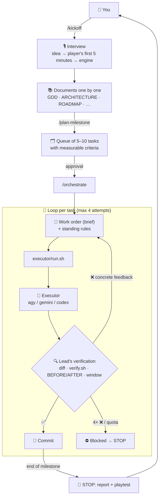

# 🦺 Vorarbeiter — Gamedev

<p align="center">
  🌐 <strong>Języki / Languages:</strong>
  <a href="README.md">🇵🇱 Polski</a> •
  <a href="README.en.md"><strong>🇬🇧 English</strong></a>
</p>

<p align="center">
  <strong>A repository template where Claude Code is the game's production lead and the code is written by a cheap executor (agy / Gemini Flash).</strong><br>
  <em>From a loose idea, through an interview and a full set of design docs, to milestones delivered task by task — with every step verified.</em>
</p>

<p align="center">
  <a href="LICENSE"></a>
  
  
  
  <a href="https://buymeacoffee.com/adrianwulf"></a>
  <a href="https://github.com/sponsors/adrian-wulf"></a>
</p>

<p align="center">
  
  
  
  
</p>

> ℹ️ The template's working language (docs, interview, skills) is **Polish**. Claude will talk to you in Polish by default — just ask it to switch.

---

## 📑 Table of Contents
1. [⚡ Why Vorarbeiter?](#-why-vorarbeiter)
2. [📊 Comparison: Claude codes alone vs Vorarbeiter](#-comparison-claude-codes-alone-vs-vorarbeiter)
3. [🏗️ How it works](#️-how-it-works)
4. [🚀 Quick Start](#-quick-start)
5. [🧭 Commands](#-commands)
6. [📚 Project documents](#-project-documents)
7. [🎮 Godot or Unity](#-godot-or-unity)
8. [🔁 Swapping the executor](#-swapping-the-executor)
9. [🗂️ Repository layout](#️-repository-layout)
10. [🌐 Adrian Wulf's Ecosystem](#-adrian-wulfs-ecosystem)
11. [☕ Support & the RobinHood dev philosophy](#-support-the-project-buy-me-a-coffee--github-sponsors--the-robinhood-dev-philosophy)
12. [⚖️ Impressum & Legal Notice](#️-impressum--legal-notice--5-ddg--mit)

---

## ⚡ Why Vorarbeiter?

*Vorarbeiter* is German for “foreman”. Building a game with an LLM agent usually breaks on three things:
1. **The agent forgets everything between sessions** — without documents it guesses what we're building and introduces inconsistencies.
2. **The strongest model is expensive** — when Claude writes every line itself, a Pro plan's limit is gone after a few tasks.
3. **The cheap model is overconfident** — it reports “done”, and the test passes because… it lowered an assertion threshold.

**Vorarbeiter fixes this by splitting the roles:**
* **Claude Code = the lead.** Talks with you about the game, writes the docs, plans milestones, writes precise work orders and **verifies** every result itself (diff, tests, running the game in a window, BEFORE/AFTER comparison).
* **agy (Gemini Flash) = the executor.** Fast and cheap — writes all the code from the work orders.
* **A hook, not a promise.** The “lead doesn't write code” rule is enforced by a Claude Code hook — an attempt to edit a `.gd`/`.cs` file is refused.
* **Memory in files.** Documents (`GDD.md`, `ARCHITECTURE.md`, `ROADMAP.md`…) and the loop state (`ORCHESTRATION_STATE.md`) survive restarts, `/clear` and switching machines.
* **Learns from mistakes.** Every recurring executor slip becomes a new “standing rule” appended to all future work orders.

The method was born while producing a real game (colony sim + factory automation in Godot): 5 complete milestones and 58 tasks were built this way — each delegated to agy, verified and committed separately.

---

## 📊 Comparison: Claude codes alone vs Vorarbeiter

| Aspect | Claude Code writes the code | 🦺 **Vorarbeiter** |
| :--- | :---: | :---: |
| **Who writes code** | Expensive model (Opus/Sonnet) | **Cheap executor** (agy / Gemini Flash) |
| **What Claude's tokens pay for** | Every line of code | **Planning and verification** |
| **Who checks the result** | The same model that wrote it | **An independent lead** (a different model than the author) |
| **Memory between sessions** | Chat history (lost) | **Documents + loop state file** |
| **Project start** | “Write me a game…” | **Interview → full docs → M0 plan** |
| **Protection against “fixing” tests** | None | **BEFORE/AFTER comparison + standing rules** |
| **Role enforcement** | None | **Hook blocking code edits** |
| **Executor** | — | **Swappable: agy / gemini / codex** |

---

## 🏗️ How it works



### ASCII diagram (for the terminal):
```
 You ──/kickoff──> [ Interview ] ──> [ Documents ] ──/plan-milestone──> [ Task queue ]
                                                                           │ approval
                                                                           v
   ┌──────────────────────────── /orchestrate ─────────────────────────────┐
   │  [ Work order + rules ] ──> executor/run.sh ──> [ agy / codex ]       │
   │            ^                                              │           │
   │            │ feedback (attempt < 4)                       v           │
   │            └──────────────── [ Lead's verification ] ─────┤           │
   │                                                           ├─ OK ──> commit
   │                                                           └─ 4× / quota ──> STOP
   └───────────────────────────────────────────────────────────────────────┘
```

---

## 🚀 Quick Start

### Requirements
* [Claude Code](https://claude.com/claude-code) (a Pro plan is enough)
* Executor: [Antigravity CLI](https://antigravity.google/) (`agy`, logged in) — or `gemini` / `codex`
* `git`, `jq`, `bash` (Linux, macOS, Windows via WSL / Git Bash)
* Godot 4.x **or** Unity — you choose during the interview

### 1. Create a project from the template
```bash
gh repo create my-game --private --template adrian-wulf/vorarbeiter-gamedev --clone
cd my-game
```
*(or the **Use this template** button on GitHub)*

### 2. Check the executor
```bash
bash executor/preflight.sh
```

### 3. Start Claude Code and the conversation
```bash
claude
```
```
/kickoff
```
Claude asks about your idea (or proposes a few concepts), describes the player's first 5 minutes, helps you pick an engine and walks you through the documents — **one at a time**. Any question can be answered with “I don't know, propose something”.

### 4. Production
```
/plan-milestone      ← splits M0 into tasks, you approve the list
/orchestrate         ← the loop starts: agy codes, Claude verifies and commits
```
After a break (new session, `/clear`, restart) just run `/orchestrate` again — the state lives in `ORCHESTRATION_STATE.md`.

---

## 🧭 Commands

| Command | What it does |
| :--- | :--- |
| `/kickoff` | Interview → project documents one by one → executor setup. Resumable. |
| `/plan-milestone` | Splits the current `ROADMAP.md` milestone into 5–10 tasks with criteria. Waits for your approval. |
| `/orchestrate` | Starts / resumes the work order → verification → commit loop. Stops after each milestone and on every blocker. |

---

## 📚 Project documents

Created during `/kickoff` from the templates in `docs-templates/`:

| Document | Role |
| :--- | :--- |
| `AGENTS.md` | First file for every agent: what the project is, reading order, rules |
| `GDD.md` | Game Design Document — pillars, loop, win/lose, first 5 minutes |
| `ARCHITECTURE.md` | Stack, layout, data, save/load, tick, communication, how to run and test |
| `ROADMAP.md` | Milestones M0…Mn with completion criteria, “out of MVP” |
| `CODING_STYLE.md` | Code conventions (GDScript or C#) |
| `ART_STYLE.md` | Visual direction, assets and licenses, palette, naming, audio |
| `GLOSSARY.md` | Agreed names — the agent does not invent its own |
| `DECISIONS.md` | Every decision: what, why, what was rejected |
| `SYSTEMS/` | One small document per system — created when work on it starts |

---

## 🎮 Godot or Unity

The template ships two profiles in `profiles/`. Once you pick an engine in `/kickoff`, the matching profile is activated and the other one is removed.

| | Godot | Unity |
| :--- | :--- | :--- |
| **Verification** | `godot --headless` for every `*/tests/test_*.gd` + leak detection at exit | `-batchmode -runTests` EditMode + PlayMode, NUnit result parsing, `CS` errors |
| **Code style** | GDScript with static typing | C# with Unity conventions, asmdef |
| **Executor rules** | autoloads, `_exit_tree`, `project.godot` | `.meta`, scene YAML, `ProjectSettings/` |
| **Status** | ✅ verified live (Godot 4.x) | ⚠️ verified against a fake editor |

---

## 🔁 Swapping the executor

All communication with the executor goes through a single script, `executor/run.sh`. Switching executors is one line in `executor/config.sh`:

```bash
EXECUTOR="${EXECUTOR:-codex}"     # executor/config.sh
bash executor/preflight.sh        # check the new executor
```
*(An `EXECUTOR=…` environment variable works too, but it must be exported before starting `claude`.)*

| Executor | Status |
| :--- | :--- |
| `agy` (Antigravity CLI) | ✅ default, verified |
| `codex` (OpenAI Codex CLI) | ⚠️ flags and error path verified; the full cycle depends on your provider |
| `gemini` (Gemini CLI) | ⚠️ not verified live |

`run.sh` exit codes: `0` OK · `1` error · `3` quota exhausted (the loop stops without committing) · `4` not logged in.

---

## 🗂️ Repository layout

```
CLAUDE.md                 the lead's role and hard rules
AGENTS.md                 project context (filled in by /kickoff)
GEMINI.md                 redirect for agy
ORCHESTRATION.md          loop algorithm, work-order contract, verification checklist
ORCHESTRATION_STATE.md    state: kickoff, queue, attempt history, lessons
.claude/hooks/            guard-code.sh — the lead doesn't edit code
.claude/skills/           kickoff, plan-milestone, orchestrate, antigravity-agents
executor/                 run.sh, preflight.sh, verify.sh, rules.md, config.sh
docs-templates/           document templates (removed after /kickoff)
profiles/godot|unity/     engine profiles (removed after /kickoff)
tests/                    tests of the template itself: bash tests/run_all.sh (removed after /kickoff)
```

---

## 🌐 Adrian Wulf's Ecosystem

Vorarbeiter is part of a family of independent, efficient tools built in the spirit of **RobinHood dev** — no subscriptions, no corporate overhead:

| Service / Project | URL | Purpose |
| :--- | :---: | :--- |
| 🦺 **Vorarbeiter — Code** | [github.com/adrian-wulf/vorarbeiter-code](https://github.com/adrian-wulf/vorarbeiter-code) | **Twin template** for any software project (PRD instead of GDD). |
| 🛡️ **Nachtwache** | [github.com/adrian-wulf/nachtwache](https://github.com/adrian-wulf/nachtwache) | **Error guardian:** lightweight drop-in Sentry replacement with AI Auto-Fix (~15 MB RAM). |
| 🚀 **Wulf Lead.er** | [lead.social-wulf.eu](https://lead.social-wulf.eu) | **B2B Lead Generator & OSINT Auditor:** client acquisition, SEO/Core Web Vitals audits. |
| 🌐 **Central Wulf Hub** | [social-wulf.eu](https://social-wulf.eu) | **Ecosystem hub:** project showcase and business tools. |
| 💼 **Wulf Code** | [wulf-code.it](https://wulf-code.it) | **Software House & Consulting:** custom deployments and bespoke software. |

---

## ☕ Support the project (Buy Me a Coffee & GitHub Sponsors) & the RobinHood dev philosophy

<p align="center">
  <a href="https://buymeacoffee.com/adrianwulf"></a>
  <a href="https://github.com/sponsors/adrian-wulf"></a>
</p>

### What is RobinHood dev?
> **“Modern engineering tools, production stability and the freedom to ship software should not be a luxury reserved for corporations with gigantic budgets.”**

Building games with AI has become a budget race: whoever pays for the most expensive plan ships. Vorarbeiter flips that logic:
* The expensive model does only what it's irreplaceable at — **understanding, planning and checking**. Code is written by a cheap or free model.
* The method, documents and loop are 100% open — no hidden paywalls, “pro” editions or telemetry.
* A solo dev on a Pro plan can run a project like a small team with a lead and an executor.

### How can you help?
If Vorarbeiter helped you ship a game or saved your plan's limits — chip in:
* ☕ **Buy a virtual coffee:** [buymeacoffee.com/adrianwulf](https://buymeacoffee.com/adrianwulf)
* 💖 **Support on GitHub Sponsors:** [github.com/sponsors/adrian-wulf](https://github.com/sponsors/adrian-wulf)
* ⭐ **Star the repo:** help the template reach more creators.
* 🛠️ **Open Pull Requests:** new engine profiles, executors, loop lessons — all welcome.

---

## ⚖️ Impressum & Legal Notice (§ 5 DDG / MIT)

### Information pursuant to § 5 of the German Digital Services Act (DDG - Digitale-Dienste-Gesetz):
This project is developed and published by:
* **Author / Service provider:** Adrian Wulf
* **Contact:** via the GitHub profile [https://github.com/adrian-wulf](https://github.com/adrian-wulf) and [https://social-wulf.eu](https://social-wulf.eu) / [https://wulf-code.it](https://wulf-code.it).

### Disclaimer & MIT License:
The software is provided **“AS IS”**, without warranty of any kind, express or implied, including but not limited to the warranties of merchantability or fitness for a particular purpose. See [LICENSE](LICENSE) for the full text.

### Attributions & trademarks:
* The `.claude/skills/antigravity-agents` skill comes from [markfulton/claude-antigravity-agents](https://github.com/markfulton/claude-antigravity-agents) (MIT) — see [NOTICE](NOTICE).
* Claude and Claude Code are trademarks of Anthropic PBC. Antigravity and Gemini are trademarks of Google LLC. Godot is a trademark of the Godot Foundation. Unity is a trademark of Unity Technologies. This project is independent and is not affiliated with, authorized or sponsored by any of these companies.

---

<p align="center">
  <em>Built with passion for the Open Source community by Adrian Wulf.</em>
</p>
