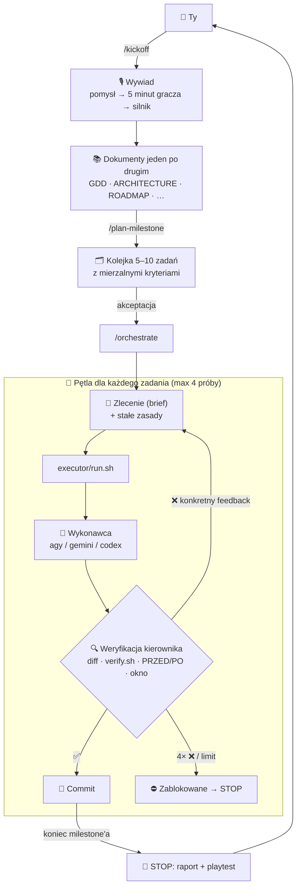

# 🦺 Brygadzista — Gamedev

<p align="center">
  🌐 <strong>Języki / Languages:</strong>
  <a href="README.md"><strong>🇵🇱 Polski</strong></a> •
  <a href="README.en.md">🇬🇧 English</a>
</p>

<p align="center">
  <strong>Szablon repozytorium, w którym Claude Code jest kierownikiem produkcji gry, a kod pisze tani wykonawca (agy / Gemini Flash).</strong><br>
  <em>Od luźnego pomysłu, przez wywiad i komplet dokumentów, po milestone'y dowożone zadanie po zadaniu — z weryfikacją każdego kroku.</em>
</p>

<p align="center">
  <a href="LICENSE"></a>
  
  
  
  <a href="https://buymeacoffee.com/adrianwulf"></a>
  <a href="https://github.com/sponsors/adrian-wulf"></a>
</p>

<p align="center">
  
  
  
  
</p>

---

## 📑 Spis Treści
1. [⚡ Dlaczego Brygadzista?](#-dlaczego-brygadzista)
2. [📊 Porównanie: Claude koduje sam vs Brygadzista](#-porównanie-claude-koduje-sam-vs-brygadzista)
3. [🏗️ Jak to działa](#️-jak-to-działa)
4. [🚀 Szybki Start](#-szybki-start)
5. [🧭 Komendy](#-komendy)
6. [📚 Dokumenty projektu](#-dokumenty-projektu)
7. [🎮 Godot czy Unity](#-godot-czy-unity)
8. [🔁 Podmiana wykonawcy](#-podmiana-wykonawcy)
9. [🗂️ Struktura repozytorium](#️-struktura-repozytorium)
10. [🌐 Ekosystem Adriana Wulfa](#-ekosystem-adriana-wulfa)
11. [☕ Wesprzyj projekt & Filozofia RobinHood dev](#-wesprzyj-projekt-buy-me-a-coffee--github-sponsors--filozofia-robinhood-dev)
12. [⚖️ Impressum & Nota Prawna](#️-impressum--nota-prawna--5-ddg--mit)

---

## ⚡ Dlaczego Brygadzista?

Tworzenie gry z agentem LLM rozbija się zwykle o trzy rzeczy:
1. **Agent nic nie pamięta między sesjami** — bez dokumentów za każdym razem zgaduje, co budujemy, i tworzy niespójności.
2. **Najmocniejszy model jest drogi** — gdy Claude sam pisze każdą linijkę kodu, limit planu Pro kończy się po kilku zadaniach.
3. **Tani model jest pewny siebie** — raportuje „gotowe”, a test przeszedł, bo… obniżył próg w asercji.

**Brygadzista rozwiązuje to podziałem ról:**
* **Claude Code = kierownik.** Prowadzi z Tobą rozmowę o grze, pisze dokumenty, planuje milestone'y, formułuje precyzyjne zlecenia i **sam weryfikuje** każdy wynik (diff, testy, uruchomienie w oknie, porównanie PRZED/PO).
* **agy (Gemini Flash) = wykonawca.** Szybki i tani — pisze cały kod na podstawie zleceń.
* **Hook, nie obietnica.** Zasada „kierownik nie pisze kodu” jest wymuszona przez hook Claude Code — próba edycji pliku `.gd`/`.cs` kończy się odmową.
* **Pamięć w plikach.** Dokumenty (`GDD.md`, `ARCHITECTURE.md`, `ROADMAP.md`…) i stan pętli (`ORCHESTRATION_STATE.md`) przeżywają restart, `/clear` i zmianę komputera.
* **Uczy się na błędach.** Każda powtarzająca się wpadka wykonawcy staje się nową „stałą zasadą” doklejaną do wszystkich kolejnych zleceń.

Metoda powstała przy produkcji prawdziwej gry (colony sim + factory automation w Godocie), gdzie w tym trybie powstało 5 pełnych milestone'ów i 58 zadań — każde zlecone agy, zweryfikowane i zacommitowane osobno.

---

## 📊 Porównanie: Claude koduje sam vs Brygadzista

| Cecha | Claude Code pisze kod sam | 🦺 **Brygadzista** |
| :--- | :---: | :---: |
| **Kto pisze kod** | Drogi model (Opus/Sonnet) | **Tani wykonawca** (agy / Gemini Flash) |
| **Na co idą tokeny Claude'a** | Na każdą linijkę kodu | **Na planowanie i weryfikację** |
| **Kto sprawdza wynik** | Ten sam model, który pisał | **Niezależny kierownik** (inny model niż autor) |
| **Pamięć między sesjami** | Historia czatu (ginie) | **Dokumenty + plik stanu pętli** |
| **Start projektu** | „Napisz mi grę…” | **Wywiad → komplet dokumentów → plan M0** |
| **Ochrona przed „naprawianiem” testów** | Brak | **Porównanie PRZED/PO + stałe zasady** |
| **Wymuszenie ról** | Brak | **Hook blokujący edycję kodu** |
| **Wykonawca** | — | **Wymienny: agy / gemini / codex** |

---

## 🏗️ Jak to działa



### Schemat ASCII (dla terminala):
```
 Ty ──/kickoff──> [ Wywiad ] ──> [ Dokumenty ] ──/plan-milestone──> [ Kolejka zadań ]
                                                                           │ akceptacja
                                                                           v
   ┌──────────────────────────── /orchestrate ─────────────────────────────┐
   │  [ Zlecenie + stałe zasady ] ──> executor/run.sh ──> [ agy / codex ]  │
   │            ^                                              │           │
   │            │ feedback (próba < 4)                         v           │
   │            └──────────────── [ Weryfikacja kierownika ] ──┤           │
   │                                                           ├─ OK ──> commit
   │                                                           └─ 4× / limit ──> STOP
   └───────────────────────────────────────────────────────────────────────┘
```

---

## 🚀 Szybki Start

### Wymagania
* [Claude Code](https://claude.com/claude-code) (wystarczy plan Pro)
* Wykonawca: [Antigravity CLI](https://antigravity.google/) (`agy`, zalogowany) — albo `gemini` / `codex`
* `git`, `jq`, `bash` (Linux, macOS, Windows przez WSL / Git Bash)
* Godot 4.x **albo** Unity — wybierasz w trakcie wywiadu

### 1. Utwórz projekt z szablonu
```bash
gh repo create moja-gra --private --template adrian-wulf/brygadzista-gamedev --clone
cd moja-gra
```
*(albo przycisk **Use this template** na GitHubie)*

### 2. Sprawdź wykonawcę
```bash
bash executor/preflight.sh
```

### 3. Odpal Claude Code i zacznij rozmowę
```bash
claude
```
```
/kickoff
```
Claude zada Ci pytania o pomysł (albo zaproponuje kilka konceptów), opisze pierwsze 5 minut gracza, pomoże wybrać silnik i przeprowadzi przez dokumenty — **jeden po drugim**. Na każde pytanie możesz odpowiedzieć „Nie wiem, zaproponuj”.

### 4. Produkcja
```
/plan-milestone      ← rozbicie M0 na zadania, akceptujesz listę
/orchestrate         ← pętla rusza: agy koduje, Claude weryfikuje i commituje
```
Po przerwie (nowa sesja, `/clear`, restart) wystarczy znowu `/orchestrate` — stan jest w `ORCHESTRATION_STATE.md`.

---

## 🧭 Komendy

| Komenda | Co robi |
| :--- | :--- |
| `/kickoff` | Wywiad → dokumenty projektu jeden po drugim → setup wykonawcy. Wznawialny. |
| `/plan-milestone` | Rozbija aktualny milestone z `ROADMAP.md` na 5–10 zadań z kryteriami. Czeka na Twoją akceptację. |
| `/orchestrate` | Uruchamia / wznawia pętlę zlecenie → weryfikacja → commit. Staje po każdym milestonie i przy każdej blokadzie. |

---

## 📚 Dokumenty projektu

Powstają w trakcie `/kickoff` z szablonów w `docs-templates/`:

| Dokument | Rola |
| :--- | :--- |
| `AGENTS.md` | Pierwszy plik dla każdego agenta: czym jest projekt, kolejność czytania, zasady |
| `GDD.md` | Game Design Document — filary, pętla, wygrana/porażka, pierwsze 5 minut |
| `ARCHITECTURE.md` | Stack, struktura, dane, save/load, tick, komunikacja, jak uruchomić i testować |
| `ROADMAP.md` | Milestone'y M0…Mn z kryteriami ukończenia, „poza MVP” |
| `CODING_STYLE.md` | Konwencje kodu (GDScript albo C#) |
| `ART_STYLE.md` | Kierunek wizualny, assety i licencje, paleta, nazewnictwo, audio |
| `GLOSSARY.md` | Ustalone nazwy — agent nie wymyśla własnych |
| `DECISIONS.md` | Każda decyzja: co, dlaczego, co odrzucono |
| `SYSTEMS/` | Jeden mały dokument na system — powstaje przy pracy nad nim |

---

## 🎮 Godot czy Unity

Szablon ma dwa profile w `profiles/`. Po wyborze silnika w `/kickoff` właściwy profil jest aktywowany, a drugi usuwany.

| | Godot | Unity |
| :--- | :--- | :--- |
| **Weryfikacja** | `godot --headless` dla wszystkich `*/tests/test_*.gd` + wykrywanie wycieków przy wyjściu | `-batchmode -runTests` EditMode + PlayMode, parsowanie wyników NUnit, błędy `CS` |
| **Styl kodu** | GDScript ze statyczną typizacją | C# z konwencjami Unity, asmdef |
| **Zasady dla wykonawcy** | autoloady, `_exit_tree`, `project.godot` | `.meta`, YAML scen, `ProjectSettings/` |
| **Status** | ✅ zweryfikowany na żywo (Godot 4.x) | ⚠️ zweryfikowany na atrapie edytora |

---

## 🔁 Podmiana wykonawcy

Cała komunikacja z wykonawcą idzie przez jeden skrypt `executor/run.sh`. Zmiana wykonawcy to jedna linia w `executor/config.sh` albo zmienna środowiskowa:

```bash
EXECUTOR=codex bash executor/preflight.sh
```

| Wykonawca | Status |
| :--- | :--- |
| `agy` (Antigravity CLI) | ✅ domyślny, zweryfikowany |
| `codex` (OpenAI Codex CLI) | ⚠️ wywołanie zweryfikowane (flagi, sandbox, kody wyjścia); pełny cykl zależy od Twojego providera |
| `gemini` (Gemini CLI) | ⚠️ niezweryfikowany na żywo |

Kody wyjścia `run.sh`: `0` OK · `1` błąd · `3` wyczerpany limit (pętla staje bez commita) · `4` brak logowania.

---

## 🗂️ Struktura repozytorium

```
CLAUDE.md                 rola kierownika i twarde reguły
AGENTS.md                 kontekst projektu (wypełnia /kickoff)
GEMINI.md                 przekierowanie dla agy
ORCHESTRATION.md          algorytm pętli, kontrakt zlecenia, checklista weryfikacji
ORCHESTRATION_STATE.md    stan: kickoff, kolejka, historia prób, lekcje
.claude/hooks/            guard-code.sh — kierownik nie edytuje kodu
.claude/skills/           kickoff, plan-milestone, orchestrate, antigravity-agents
executor/                 run.sh, preflight.sh, verify.sh, rules.md, config.sh
docs-templates/           szablony dokumentów (usuwane po /kickoff)
profiles/godot|unity/     profile silników (usuwane po /kickoff)
tests/                    testy samego szablonu: bash tests/run_all.sh
```

---

## 🌐 Ekosystem Adriana Wulfa

Brygadzista jest częścią rodziny niezależnych, wydajnych narzędzi tworzonych w duchu **RobinHood dev** — bez abonamentów i korporacyjnego narzutu:

| Usługa / Projekt | Adres URL | Przeznaczenie |
| :--- | :---: | :--- |
| 🦺 **Brygadzista — Code** | [github.com/adrian-wulf/brygadzista-code](https://github.com/adrian-wulf/brygadzista-code) | **Bliźniaczy szablon** dla dowolnego projektu programistycznego (PRD zamiast GDD). |
| 🛡️ **Nachtwache** | [github.com/adrian-wulf/nachtwache](https://github.com/adrian-wulf/nachtwache) | **Strażnik błędów:** lekki drop-in zamiennik Sentry z AI Auto-Fix (~15 MB RAM). |
| 🚀 **Wulf Lead.er** | [lead.social-wulf.eu](https://lead.social-wulf.eu) | **Generator Leadów B2B & Audytor OSINT:** pozyskiwanie klientów, audyty SEO/Core Web Vitals. |
| 🌐 **Centralny Wulf Hub** | [social-wulf.eu](https://social-wulf.eu) | **Główny Hub Ekosystemu:** wizytówka projektów i narzędzia biznesowe. |
| 💼 **Wulf Code** | [wulf-code.it](https://wulf-code.it) | **Software House & Consulting:** dedykowane wdrożenia i oprogramowanie na zamówienie. |

---

## ☕ Wesprzyj projekt (Buy Me a Coffee & GitHub Sponsors) & Filozofia RobinHood dev

<p align="center">
  <a href="https://buymeacoffee.com/adrianwulf"></a>
  <a href="https://github.com/sponsors/adrian-wulf"></a>
</p>

### Czym jest filozofia RobinHood dev?
> **„Nowoczesne narzędzia inżynierskie, stabilność produkcji i swoboda wdrażania oprogramowania nie powinny być luksusem zarezerwowanym wyłącznie dla korporacji z gigantycznymi budżetami.”**

Tworzenie gier z pomocą AI stało się wyścigiem na budżety: kto płaci za najdroższy plan, ten dowozi. Brygadzista odwraca tę logikę:
* Drogi model robi tylko to, w czym jest niezastąpiony — **rozumie, planuje i sprawdza**. Kod pisze model tani lub darmowy.
* Metoda, dokumenty i pętla są w 100% otwarte — bez ukrytych paywalli, płatnych wersji „pro” ani telemetrii.
* Solo-dev z planem Pro może prowadzić projekt jak mały zespół z kierownikiem i wykonawcą.

### Jak możesz pomóc?
Jeśli Brygadzista pomógł Ci dowieźć grę albo zaoszczędził limit w planie — dołóż cegiełkę:
* ☕ **Postaw wirtualną kawę:** [buymeacoffee.com/adrianwulf](https://buymeacoffee.com/adrianwulf)
* 💖 **Wspieraj na GitHub Sponsors:** [github.com/sponsors/adrian-wulf](https://github.com/sponsors/adrian-wulf)
* ⭐ **Zostaw gwiazdkę na GitHubie:** pomóż szablonowi dotrzeć do kolejnych twórców.
* 🛠️ **Twórz Pull Requesty:** nowe profile silników, wykonawców, lekcje z pętli — mile widziane.

---

## ⚖️ Impressum & Nota Prawna (§ 5 DDG / MIT)

### Informacje zgodnie z § 5 niemieckiej ustawy o usługach cyfrowych (DDG - Digitale-Dienste-Gesetz):
Projekt jest rozwijany i publikowany przez:
* **Autor / Usługodawca:** Adrian Wulf
* **Kontakt:** Dostępny za pośrednictwem profilu GitHub: [https://github.com/adrian-wulf](https://github.com/adrian-wulf) oraz platformy [https://social-wulf.eu](https://social-wulf.eu) / [https://wulf-code.it](https://wulf-code.it).

### Wyłączenie odpowiedzialności (Disclaimer) & Licencja MIT:
Oprogramowanie jest dostarczane w stanie, w jakim się znajduje (**„AS IS”**), bez jakichkolwiek gwarancji, wyraźnych lub dorozumianych, w tym m.in. gwarancji przydatności handlowej lub przydatności do określonego celu. Pełna treść licencji dostępna jest w pliku [LICENSE](LICENSE).

### Atrybucje i znaki towarowe:
* Skill `.claude/skills/antigravity-agents` pochodzi z [markfulton/claude-antigravity-agents](https://github.com/markfulton/claude-antigravity-agents) (MIT) — szczegóły w pliku [NOTICE](NOTICE).
* Claude i Claude Code są znakami towarowymi Anthropic PBC. Antigravity i Gemini są znakami towarowymi Google LLC. Godot jest znakiem towarowym Godot Foundation. Unity jest znakiem towarowym Unity Technologies. Projekt jest niezależny i nie jest powiązany, autoryzowany ani sponsorowany przez żadną z tych firm.

---

<p align="center">
  <em>Stworzone z pasją dla społeczności Open Source przez Adriana Wulfa.</em>
</p>
